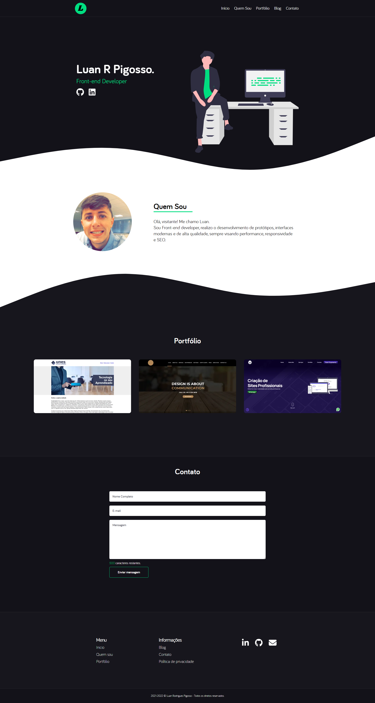

<h1 align="center">
  Portfólio 2.0
</h1>

<!-- 

<h4 align="center"><a href="https://www.luanrodriguespigosso.com.br">Clique para visitar o projeto</a></h4> -->

## 📚 Seções

- **Home:** Nele temos uma breve apresentação;
- **Portfólio:** Apresenta alguns projetos desenvolvidos com link direto para os respectivos projeto publicado;
- **Tecnologias:** Será listado todas as tecnologias e os níveis de experiência: Básico, Intermediário e Avançado;
- **Sobre min:** Nessa seção tenho uma descrição dizendo um pouco sobre quem sou;

## 💼 Tecnologias utilizadas

- HTML;
- CSS;
- JavaScript;
