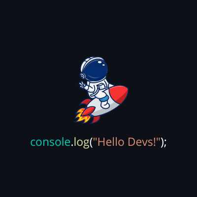

<!--

-->

 
  🖖 Olá, visitante! Meu nome é Luan Rodrigues Pigosso.

  ☕ Habilidades: <strong>HTML, CSS, WordPress</strong>

  📚 Estudando: <strong>JavaScript, Node.js, SQL, React</strong>

  💼 Ferramentas: <strong>Vs Code, Figma, Canva, Trello, Vercel, Git e GitHub</strong>

 

  

  

