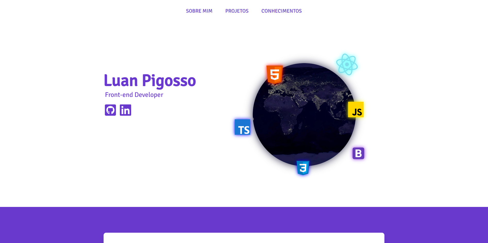

<h1 align="center">
  Portfólio - Luan Pigosso
</h1>

<h4 align="center"><a href="https://www.luanrodriguespigosso.com.br">Clique para visitar o projeto</a></h4>

## 📚 Seções

- **Home:** Nele temos uma breve apresentação;
- **Quem sou:** Nessa seção tenho uma descrição dizendo um pouco sobre quem sou;
- **Portfólio:** Apresenta alguns projetos desenvolvidos e com link direto para os respectivos projeto publicado;
- **Blog:** Terá conteúdo de programação e tecnologia;
- **Contato:** Neste formulário é possível me enviar seu qualquer dúvida, sugestão ou até mesmo expandir sua rede de *networking* (pessoal);

## 💼 Tecnologias utilizadas

- HTML;
- CSS;
- JavaScript;
- PHP;